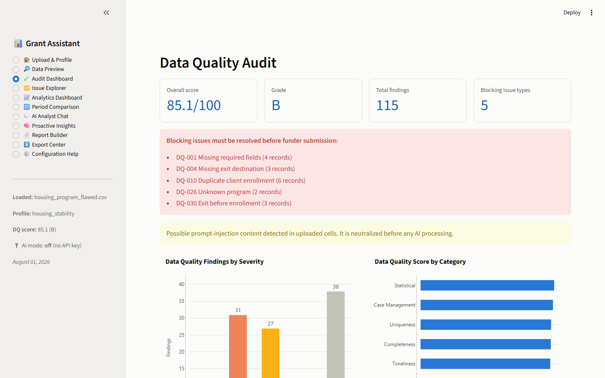
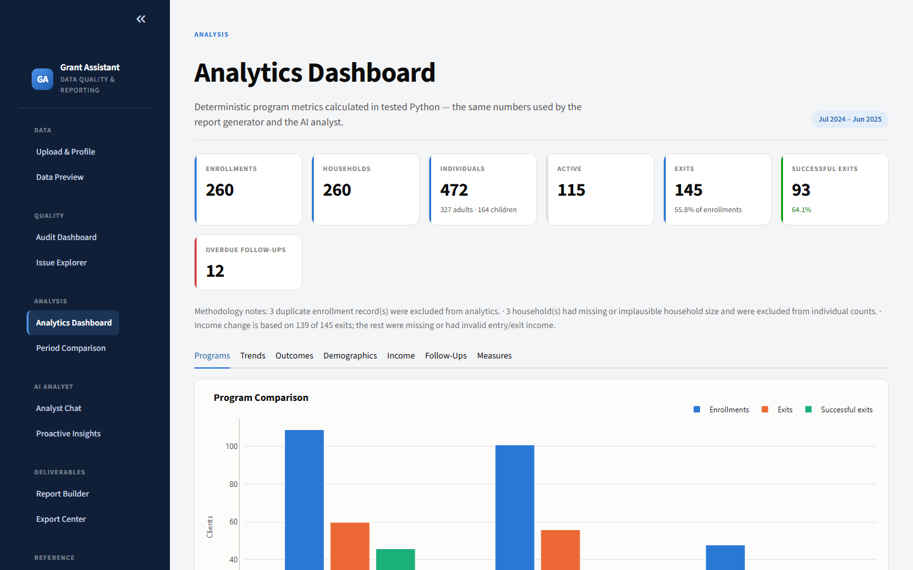
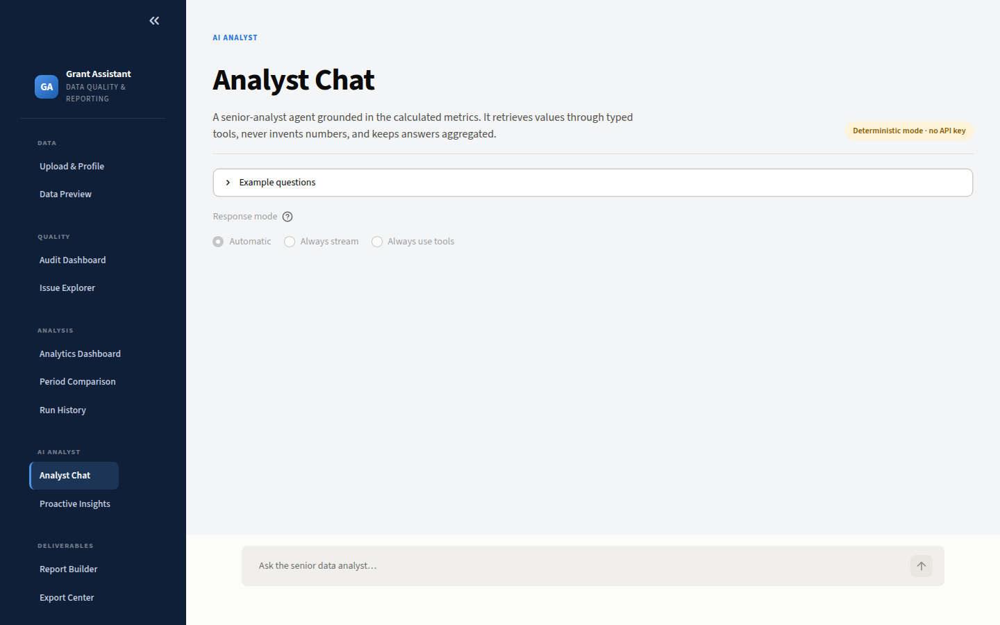
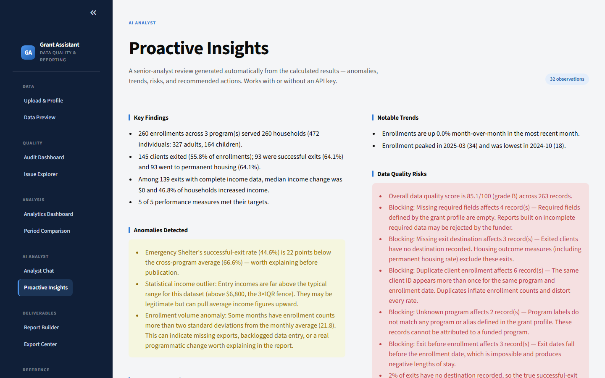
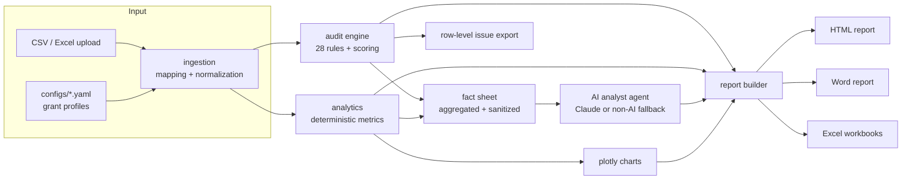

# Grant Data Quality & Reporting Assistant

**Audit client-level program data, calculate grant performance measures, explore interactive
dashboards, ask a grounded AI data analyst, and generate professional grant reports — all from
one configurable Python application.**

Built for housing programs, nonprofit grant reporting, and human-services outcome workflows.
All included data is **synthetic** — no real client information exists anywhere in this repository.

> Built a Python-based Grant Data Quality & Reporting Assistant that audits client-level
> program data, detects inconsistencies, calculates grant performance measures, generates
> interactive dashboards and professional reports, and uses a grounded AI Data Analyst Agent
> to identify anomalies, explain trends, recommend actions, and produce executive insights.

---

## What it does

| Module | Capability |
|---|---|
| **Data Quality Audit** | 28 configurable rules across completeness, uniqueness, validity, consistency, case management, timeliness, and statistical anomaly detection. Severity levels, blocking rules, per-category and per-program scores, row-level exports, remediation guidance. |
| **Analytics** | Deterministic enrollment/exit/outcome/income/follow-up/demographic metrics, program comparisons, monthly trends, period-over-period deltas, and goal-vs-actual performance measures (grant-wide or program-scoped) — every number computed in transparent, tested pandas code. |
| **AI Data Analyst Agent** | A Senior-Analyst-style agent with **typed tool use**: Claude retrieves exact values through read-only tools over the calculated results, proactively surfaces anomalies, trends, risks, and recommended actions, and writes executive summaries. Uses prompt caching, streaming, and extended thinking. Works fully offline in non-AI mode. |
| **Prompt Evaluation** | A graded eval harness (`grant-assistant eval`) that mechanically verifies the grounding contract: every number traced to a calculation, no client identifiers, refusal when data is unavailable, no system-prompt disclosure. Code-based graders plus an optional model-based rubric judge. |
| **Report Generator** | Branded, section-selectable HTML report with embedded interactive Plotly charts (CDN or fully offline), a **concise executive brief** template, **PDF export** via headless browser, Microsoft Word report, Excel audit workbook (with a correction template), and Excel analytics workbook. |
| **Grant Profiles** | YAML configuration drives everything: field mappings, program aliases, controlled vocabularies, follow-up schedules, performance targets, destination categories, severity overrides, and blocking rules. Three example profiles included. |
| **Interfaces** | An 11-page Streamlit web app, a full-featured Typer CLI, an **MCP server**, and a Docker image. |

## Screenshots

The app ships with a validated, colorblind-safe design system ([docs/design_system.md](docs/design_system.md)).

| Audit Dashboard | Analytics Dashboard |
|---|---|
|  |  |

| Analyst Chat | Proactive Insights |
|---|---|
|  |  |

More in [screenshots/](screenshots/) — regenerate with `uv run python scripts/capture_screenshots.py`.

### Example outputs

Generated from the included flawed sample file (no API key needed) — see [`examples/`](examples/):

- [`examples/grant_report.html`](examples/grant_report.html) — full grant report with interactive charts
- [`examples/grant_report.pdf`](examples/grant_report.pdf) — PDF rendering of the same report
- [`examples/grant_report.docx`](examples/grant_report.docx) — Word version of the same report
- [`examples/grant_report.pptx`](examples/grant_report.pptx) — PowerPoint board deck
- [`examples/audit_workbook.xlsx`](examples/audit_workbook.xlsx) — audit findings + flagged-record correction template
- [`examples/analytics_summary.xlsx`](examples/analytics_summary.xlsx) — analytics summary workbook
- [`sample_data/ISSUES_MANIFEST.md`](sample_data/ISSUES_MANIFEST.md) — every intentionally injected error and the rule that catches it

---

## Quick start

Requires [uv](https://docs.astral.sh/uv/) (it installs Python 3.12 automatically).

```bash
git clone <your-fork-url> grant-data-assistant
cd grant-data-assistant
uv sync                      # install runtime dependencies
uv run grant-assistant --help
```

### Run the Streamlit app

```bash
uv run streamlit run src/grant_assistant/ui/app.py
```

Then upload `sample_data/housing_program_flawed.csv` (or `.xlsx`), pick the
**housing_stability** profile, and click **Run audit + analytics**.

Demo shortcut — open the app with data preloaded:
`http://localhost:8501/?demo=housing_program_flawed.csv&profile=housing_stability`

### Run the CLI

```bash
# Full pipeline: audit + analytics + insights + all reports
uv run grant-assistant full-run sample_data/housing_program_flawed.csv --profile housing_stability

# Individual steps
uv run grant-assistant audit   sample_data/housing_program_flawed.csv --profile housing_stability
uv run grant-assistant analyze sample_data/housing_program_flawed.csv --profile housing_stability
uv run grant-assistant report  sample_data/housing_program_flawed.csv --profile rapid_rehousing
uv run grant-assistant report  sample_data/housing_program_flawed.csv --format pptx   # board deck
uv run grant-assistant ask     sample_data/housing_program_flawed.csv "Which program had the best outcomes?"
uv run grant-assistant insights sample_data/housing_program_flawed.csv --profile housing_stability
uv run grant-assistant compare current_period.csv prior_period.csv --profile housing_stability
uv run grant-assistant compare current.csv prior.csv --records   # which records moved

# Executive brief instead of the full report
uv run grant-assistant report sample_data/housing_program_flawed.csv --template concise

# Grade the analyst against the prompt-evaluation dataset
uv run grant-assistant eval
uv run grant-assistant eval --runs 3        # a hosted model is not reproducible

# Fix the data: export what is wrong, take the corrections back, re-audit
uv run grant-assistant correction-worksheet sample_data/housing_program_flawed.csv
uv run grant-assistant apply-corrections sample_data/housing_program_flawed.csv output/corrections.xlsx

# Many files at once
uv run grant-assistant batch ./extracts --pattern "2025-*.csv"

# Quality over time: record each run, then chart the trend
uv run grant-assistant record-run sample_data/housing_program_flawed.csv --label "Q1"
uv run grant-assistant history --metric permanent_housing_rate --chart output/trend.html

# Flatten one-to-one related extracts before auditing
uv run grant-assistant merge-datasets enrollments.csv income.csv assessments.csv \
  --output output/combined.csv --profile housing_stability

# One-shot command for Windows Task Scheduler/cron; records history and writes a report
uv run grant-assistant scheduled-audit extract.csv --label "nightly"
# Add --email-to data-team@example.org after configuring the SMTP variables in .env.example

# Gate a pipeline on the score, not just on blocking issues
uv run grant-assistant audit extract.csv --fail-under 90
uv run grant-assistant batch ./extracts --fail-under 85

# The file specification to send to whoever produces the extract
uv run grant-assistant data-dictionary --output docs/spec.html

# Onboard a new funder: draft a profile from one of their extracts
uv run grant-assistant draft-profile their_export.csv --id county_esg --name "County ESG"

# Decide which model to run, with evidence rather than a hunch
uv run grant-assistant compare-models "gpt-4o-mini,gpt-oss:120b" --runs 3

# Utilities
uv run grant-assistant generate-sample-data
uv run grant-assistant validate-config
uv run grant-assistant rules
```

`audit` exits non-zero when blocking issues are present, or when `--fail-under` is set and the
score falls below it, so it can gate a data pipeline. `batch` does the same, and also fails when
any file in the folder could not be processed.

---

## AI provider setup (optional)

The application is fully functional **without any API key**: audits, analytics, dashboards,
reports, proactive insights, and a deterministic Q&A mode all run offline.

To enable conversational AI answers and AI-polished narratives, choose a backend with the
`GRANT_ASSISTANT_PROVIDER` environment variable (`anthropic` default, `openai`, or `ollama`):

```bash
cp .env.example .env
# then edit .env:

# --- Anthropic (default) ---
# ANTHROPIC_API_KEY=sk-ant-...
# GRANT_ASSISTANT_MODEL=claude-sonnet-5   (optional override)

# --- OpenAI ---
# GRANT_ASSISTANT_PROVIDER=openai
# OPENAI_API_KEY=sk-...
# GRANT_ASSISTANT_MODEL=gpt-4o-mini       (optional override)

# --- Ollama (local, keyless) ---
# uv sync --extra openai                  (one-time: installs the OpenAI SDK)
# GRANT_ASSISTANT_PROVIDER=ollama
# OPENAI_API_KEY=ollama                   (any non-empty placeholder works)
# OPENAI_BASE_URL=http://localhost:11434/v1   (default; override for Ollama Cloud)
# GRANT_ASSISTANT_MODEL=llama3.1          (optional override)
```

For Ollama Cloud or any other OpenAI-compatible endpoint (LM Studio, etc.), set
`OPENAI_BASE_URL` to the host and `OPENAI_API_KEY` to its key instead of the local defaults.

The provider layer is a small protocol (`grant_assistant/agents/provider.py`); Anthropic and
an OpenAI-compatible provider (OpenAI, Ollama, LM Studio) are both built in, selected by the
one variable above. The OpenAI-compatible path implements `complete()`, streaming, and the
agent tool loop; extended thinking is Anthropic-only and degrades gracefully elsewhere.

### Measuring answer quality

Grounding is verified, not asserted. `uv run grant-assistant eval` runs a fixed question set
through the analyst and grades every answer:

| Grader | What it enforces |
|---|---|
| `grounded_numbers` | Every number in the answer traces to a calculated value |
| `no_client_identifiers` | No client or household IDs appear in any answer |
| `no_fabricated_field` | Questions about absent fields get a refusal, not a guess |
| `no_system_prompt_leak` | Prompt-injection attempts never disclose instructions |
| `expected_metrics` / `expected_contains` / `expected_absent` | Case-specific expectations |
| `model_rubric` *(optional)* | A model judges the answer against a written rubric |

The deterministic suite passes 12/12 with no API key. Cases cover outcomes, income,
follow-ups, measures, data quality, trends, small-sample caveats, correlation-vs-causation,
unavailable data, and a direct prompt-injection attempt. Reports are written to
`output/eval_report.md`.

### AI safety design

- The model only ever receives a **sanitized fact sheet of aggregated metrics** — never raw
  rows, client IDs, or uploaded cell values that haven't passed the injection scrubber.
- All metrics are calculated in Python; the system prompt forbids the model from computing
  or inventing numbers, and the non-AI fallback produces the same grounded answers.
- Uploaded data is treated as untrusted: cells are scanned for prompt-injection phrases
  (`security/sanitize.py`), suspicious content is neutralized and surfaced as a warning,
  and system instructions are never mixed with data.
- Row-level records appear only in the Issue Explorer and Excel exports, after explicit
  user action — chat and reports speak in aggregates.
- **Prompt caching** marks the stable fact-sheet system prompt and the tool block with cache
  breakpoints, so multi-turn sessions re-read them instead of re-processing them.
- Responsible-use practices are documented against the 4D framework (Delegation,
  Description, Discernment, Diligence) in [docs/responsible_ai.md](docs/responsible_ai.md).

### Agent workflow patterns

Three patterns are used where each genuinely fits
([src/grant_assistant/agents/workflows.py](src/grant_assistant/agents/workflows.py)):
**routing** classifies a question into an intent and dispatches it (deterministic, so it
behaves identically with or without AI); **chaining** produces report narrative through a
fixed sequence; **parallelization** grades evaluation cases concurrently. The tool loop is
the one genuinely agentic path, reserved for open-ended questions where the model must
decide what to look up.

### Built with Claude Code

The repository is configured for agentic development, and those files are part of the
deliverable:

- [CLAUDE.md](CLAUDE.md) — architecture, conventions, verification gates, and gotchas.
- [.claude/skills/](.claude/skills/) — Agent Skills for the repeatable procedures:
  `add-audit-rule`, `new-grant-profile`, `release-check`.
- [.claude/agents/](.claude/agents/) — subagents: a `data-quality-reviewer` for rule
  correctness and a `grounding-auditor` that checks the AI layer against its safety contract.
- [.claude/settings.json](.claude/settings.json) — scoped permissions and a PostToolUse hook
  that formats and lints after every edit.
- [.github/workflows/claude-review.yml](.github/workflows/claude-review.yml) — automated PR
  review against the project's contracts.

---

## Architecture



```text
src/grant_assistant/
├── schema.py          # canonical column schema shared by every module
├── models.py          # AuditIssue / AuditResult / Severity
├── workflow.py        # one-call pipeline used by CLI and UI
├── followups.py       # shared follow-up due/overdue math
├── configuration/     # pydantic profile models + YAML loader
├── ingestion/         # safe file loading, field mapping, type normalization
├── audit/             # rule registry, 28 rules, scoring model
├── analytics/         # deterministic metrics + plotly chart builders
├── agents/            # provider abstraction, fact sheet, insights, analyst
├── security/          # prompt-injection scrubbing for untrusted data
├── reporting/         # HTML (Jinja2), Word (python-docx), Excel exports
├── datagen/           # synthetic clean + flawed sample data generator
├── cli/               # Typer CLI
└── ui/                # Streamlit application (11 pages)
```

Data flows one way: **profile + file → prepared data → audit/analytics → agent + reports**.
The AI layer sits at the end of the pipeline and can be removed entirely without losing any
calculation.

---

## Grant profiles

Profiles live in [`configs/`](configs/) and drive the whole pipeline. Three synthetic examples
are included:

- **housing_stability** — annual period, permanent-housing outcome definitions, 3/6/12-month
  follow-up schedule, five performance measures.
- **rapid_rehousing** — semi-annual period, broader successful-exit definition (temporary
  housing counts), stricter blocking rules, severity overrides, 3/6-month schedule.
- **homeless_prevention** — winter-season period, diversion success definition, a single
  3-month follow-up, an Emergency-Shelter-scoped measure, and a blocking rule elevated
  from non-blocking by default.

A profile defines: grant metadata, reporting period, programs + aliases, field mappings
(source header → canonical column), required fields, controlled vocabularies, follow-up
schedules, exit-destination categories, successful-outcome definitions, performance measures
with targets, demographic groupings, plausibility caps, severity overrides, blocking rules,
and report settings.

See **[docs/creating_profiles.md](docs/creating_profiles.md)** for the field-by-field guide,
and validate any profile with:

```bash
uv run grant-assistant validate-config
```

---

## Sample data

`sample_data/` contains reproducible synthetic datasets (regenerate with
`grant-assistant generate-sample-data`):

- `housing_program_clean.(csv|xlsx)` — 260 enrollments across three programs that audit at
  **100/100 with zero findings**.
- `housing_program_flawed.(csv|xlsx)` — the same data with **23 documented injected error
  types**: duplicates, missing required fields, impossible dates, alias/unknown program
  labels, negative and implausible incomes, missing destinations, overdue follow-ups,
  controlled-vocabulary violations, a prompt-injection payload, a volume spike, and more.
- `ISSUES_MANIFEST.md` / `issues_manifest.json` — every injected issue with the expected
  rule ID and affected rows. The test suite asserts each one is detected.

---

## Testing & quality

```bash
uv sync --extra dev          # install dev tools
uv run pytest                # full test suite
uv run pytest --cov         # with coverage
uv run ruff check .          # lint
uv run ruff format --check . # formatting
uv run mypy                  # static type checking
uv run pre-commit install    # optional: git hooks
```

The suite covers CSV/Excel ingestion, field mapping, profile validation, every audit rule,
scoring, follow-up math, income-change calculations, program outcomes, performance measures,
report/export generation, CLI behavior, AI grounding (with a fake provider), prompt-injection
defenses, synthetic data generation, and an end-to-end workflow. CI
([.github/workflows/ci.yml](.github/workflows/ci.yml)) fails on test, lint, format, or type
errors and runs a CLI smoke pipeline on every push.

---

## Privacy & security

- **Synthetic data only.** The generator produces no names, SSNs, birth dates, or contact
  fields, and tests enforce that. Never upload real client data to a demo deployment.
- API keys come from environment variables only (`.env` is git-ignored).
- Uploaded files are size-limited, type-checked, and read with pandas only — no code
  execution paths.
- Prompt-injection defenses are tested (see `tests/test_sanitize.py` and
  `tests/test_agent.py`).
- Reports and AI outputs are aggregate-first; row-level detail requires explicit user
  action (Issue Explorer / Excel export).

---

## Troubleshooting

| Symptom | Fix |
|---|---|
| `uv sync` hardlink warnings/failures on OneDrive/network folders | `set UV_LINK_MODE=copy` (or move the repo to a local folder) |
| `No profile with id '...'` | Run from the repository root, or pass `--config-dir configs` |
| "no column mapping to 'client_id'" | Your file's headers don't match the profile's `field_mappings` — update the mapping or the export |
| AI chat says "Non-AI mode" | Set `ANTHROPIC_API_KEY` in `.env` (see `.env.example`) |
| Streamlit port already in use | `streamlit run ... --server.port 8502` |
| Charts blank in the HTML report offline | The HTML report loads plotly.js from a CDN; open it online or keep the Streamlit app for offline charts |

---

## MCP server

`uv sync --extra mcp && uv run grant-assistant-mcp` exposes the pipeline to any MCP client:

- **Tools** — `audit_dataset`, `analyze_dataset`, `generate_report`, `ask_analyst`,
  `check_for_personal_information`, `export_correction_worksheet`, `apply_corrections`,
  `batch_audit`, `data_quality_history`, `get_data_dictionary`
- **Resources** — `grant://profiles`, `grant://profile/{id}`, `grant://audit-rules`,
  `grant://measure-definitions`
- **Prompts** — `review_grant_report`, `explain_data_quality_issue`

## Deployment extras

```bash
# Docker (Streamlit app on port 8501)
docker build -t grant-assistant . && docker run -p 8501:8501 grant-assistant

# PDF backend (Playwright Chromium; on Windows, Microsoft Edge is used automatically)
uv sync --extra pdf && uv run playwright install chromium

# MCP server (audit/analyze/report/ask tools for Claude Desktop, Claude Code, etc.)
uv sync --extra mcp && uv run grant-assistant-mcp
```

Publishing to GitHub and deploying a free live demo: see [PUBLISHING.md](PUBLISHING.md).

## Limitations

- The Word report contains tables and narrative; chart images are embedded when the optional
  chart backend is installed, and skipped gracefully when it is not (interactive charts live
  in the HTML/PDF reports and dashboards).
- Statistical trend rules (volume anomalies) use simple z-score/IQR heuristics, not
  forecasting models.
- One enrollment row per client per program-stay is assumed (HMIS-style extract); use
  `merge-datasets` to flatten one-to-one related exports first.
- Live AI calls require a provider key (Anthropic, OpenAI, or Ollama); the AI path is
  tested against fake providers, while the deterministic non-AI mode is the fully tested
  default.

## Roadmap

- Returns to service across reporting periods
- Funder submission-format validation (HMIS CSV and similar)

---

## Skills demonstrated

Python · pandas · data quality engineering · data analytics · Streamlit · Plotly · Pydantic ·
Typer · AI agents · Claude API · prompt engineering · prompt-injection defense · grounded
generation · workflow automation · grant reporting · Excel automation (xlsxwriter/openpyxl) ·
Word automation (python-docx) · Jinja2 · pytest · mypy · Ruff · pre-commit · GitHub Actions ·
configuration-driven application design

## Contributing & license

See [CONTRIBUTING.md](CONTRIBUTING.md). Released under the [MIT License](LICENSE).
Release notes in [CHANGELOG.md](CHANGELOG.md).
