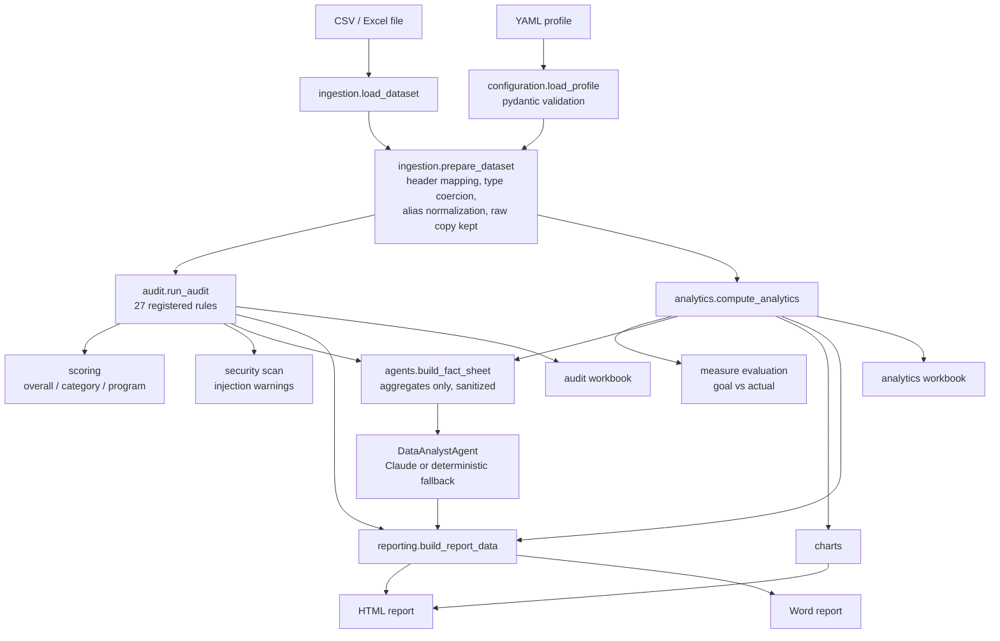

# Architecture

## Design principles

1. **Deterministic core, optional AI shell.** Every metric, score, and finding is computed
   in plain pandas/Python and covered by tests. The AI layer narrates those results; it
   never calculates. Removing the API key removes zero functionality from audits,
   analytics, or reports.
2. **Configuration over code.** Grant-specific behavior (mappings, vocabularies, targets,
   schedules, severities) lives in YAML profiles validated by pydantic — not in Python.
3. **One canonical schema.** Ingestion maps any funder's spreadsheet headers onto
   `schema.py`'s canonical columns once; every downstream module depends only on the
   canonical names.
4. **Untrusted input everywhere.** Uploads are size/type-checked, values are treated as
   data (never instructions), and anything data-derived is sanitized before reaching an
   AI prompt.

## Data flow

## Module notes

### ingestion
`prepare_dataset` returns both the normalized frame (`df`) and the pre-coercion values
(`raw`) with identical shape. Audit rules use `raw` to distinguish *missing* from
*present-but-invalid* — e.g. DQ-020 fires when `raw` has text but `df` parsed to NaT.

### audit
Rules are functions registered by decorator with metadata (id, name, category, default
severity, blocking). The engine applies profile overrides per finding, so the same rule can
be `medium` for one funder and `high`/blocking for another. A rule that raises is logged and
skipped — one bad rule never kills an audit.

Scoring: `score = 100 × (1 − Σ severity_weight × unique_rows / (8 × total_rows))`, floored
at 0. Weights: critical 8, high 5, medium 3, low 1, info 0. The same formula runs overall,
per category, and per program (using each program's row count), so scores are comparable.

### analytics
`AnalyticsResult` is a pydantic model: serializable to JSON, exportable to Excel frames,
and the single source for charts, reports, and the AI fact sheet. Exact duplicate
enrollments are removed before computation (and disclosed in `notes`). Denominators below
10 set `small_sample` flags that surface everywhere downstream.

### agents
`AIProvider` is a two-member protocol (`name`, `complete`). Two backends implement it:
`AnthropicProvider` and `OpenAICompatibleProvider` (OpenAI, Ollama, any OpenAI-compatible
endpoint), selected by the `GRANT_ASSISTANT_PROVIDER` env var. `get_provider()` returns
`None` when the selected provider lacks its credentials, which flips every consumer into
deterministic mode. The fact sheet is the *only* data the model sees: aggregated metrics
with all data-derived strings passed through `security.sanitize_text`. Proactive insights
(`generate_insights`) are computed rules over the analytics/audit results — the AI, when
present, only rewrites them as prose with instructions to keep every number unchanged.

### reporting
`ReportData` bundles profile + analytics + audit + insights + executive summary. The HTML
renderer embeds Plotly figures as fragments (plotly.js from CDN); the Word renderer builds
the same sections as tables and text; Excel exports include a "Flagged Records" sheet that
doubles as a correction template (original row + issues found + blank corrected-value
columns).

### datagen
`generate_clean_dataset` produces data that audits at exactly 100/100 (verified by test).
`inject_issues` corrupts a copy with 23 documented error types and emits a manifest of
expected rule IDs per row; `tests/test_audit_manifest.py` asserts every entry is caught.

## Testing strategy

- **Rule-level:** each audit rule gets a minimal hand-built dataset (valid template row +
  one targeted corruption) asserting exactly which client is flagged.
- **Manifest-level:** the full flawed sample must trip every expected rule on the expected
  rows — this is the "the demo actually demonstrates" guarantee.
- **Metric-level:** analytics run against a 6-row dataset with hand-computed expected
  values (rates, income changes, categories, trends).
- **Grounding-level:** a fake provider records the exact system prompt to assert the fact
  sheet is present, sanitized, and aggregate-only; fallback answers are checked against
  calculated metrics, including a "no invented numbers" scan.
- **End-to-end:** Excel file → pipeline → agent → all four artifacts on disk.
